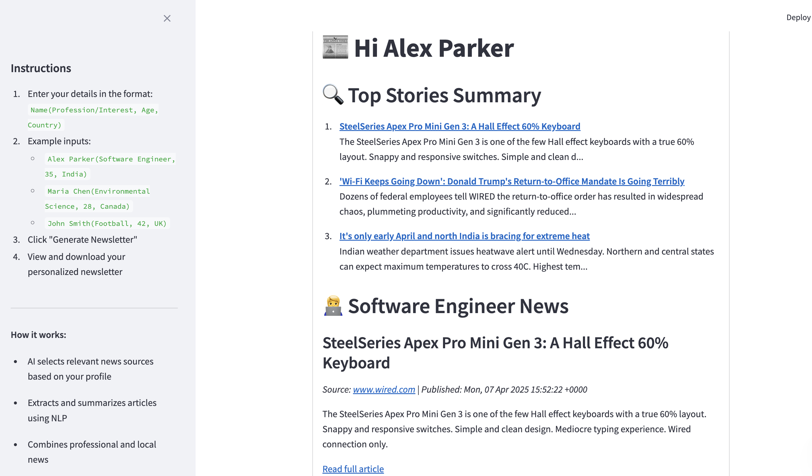

# 🧠 AI-Powered Newsletter Generator 📰

An AI-powered tool that generates well-structured newsletters by automatically extracting, summarizing, and formatting the latest news based on your query using GPT-3.5.

---

## 🌟 Features

- 🔎 Fetches top articles from Google News based on user input.
- 🤖 Uses OpenAI's GPT model to summarize full articles.
- 📰 Formats the output into a clear, readable newsletter.
- 💻 Streamlit UI for interactive use.

---


## 🏗️ File Structure

```
├── extracter.py             # Core logic: fetch, summarize, and generate newsletter
├── README.md                # Project documentation
├── requirements.txt         # Python dependencies (optional but recommended)
└── streamlit_app_screenshot.png
```

---

## ⚙️ Setup Instructions

### 🔧 1. Clone the Repository

```bash
git clone https://github.com/your-username/ai-newsletter-generator.git
cd ai-newsletter-generator
```

### 📦 2. Install Dependencies

```bash
pip install -r requirements.txt
```


### 🔑 3. Add OpenAI API Key

Set your API key as an environment variable:

```bash
export OPENAI_API_KEY="your_api_key_here"
```

Or directly inside the script (not recommended for production).

---

## 🧠 How It Works

1. You input a topic or query (e.g., "Alex Parker(Software Engineer, 35, India)").
2. The script scrapes the top 10 news articles from Google News.
3. Each article is summarized using OpenAI's GPT model.
4. The output is displayed as a formatted newsletter with title and summary.

---

## 🚀 Running the App

### 🐍 CLI (Command Line)

```bash
python extracter.py
```

### 🌐 Streamlit Web App

```bash
streamlit run app.py
```

---

## 📄 Example Output


---

## ✍️ Author

**Ananya Nagpal**  
B.Tech, Electrical Engineering  
IIT Jodhpur

---

## 📌 Future Improvements

- [ ] Email delivery support
- [ ] Translation to desired languages.

---
